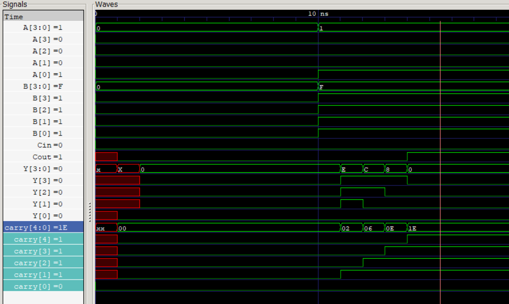

You have the structural architecture of a testbench perfectly mapped out. You hit the three main phases: declaring signals, instantiating the Device Under Test (DUT), and driving the simulation with an `initial` block.

However, you have stumbled into a classic Verilog syntax trap right at the top. The compiler (`iverilog`) is going to throw a massive wall of red errors if you try to run this right now.

Here are the fixes you need to make before hitting run:

### 1. The Missing Parameter

You used `[WIDTH-1:0]` for your vectors, but you never actually told the testbench what `WIDTH` is. You must declare the parameter before you use it to size your logic.

### 2. The Comma vs. Semicolon Trap

In SystemVerilog port lists (inside the `module (...)` parentheses), you separate items with commas. But when you are declaring internal signals *inside* the module, they are standard statements. **They must end with semicolons (`;`).**

### 3. The Instantiation Parameter Mapping

Because your `nrca` module uses a parameter, it's best practice to explicitly pass that parameter during instantiation using `#(.WIDTH(WIDTH))` so the sizes match perfectly.

### The Corrected Code

Here is your testbench, fixed up and loaded with the worst-case test scenario so you can actually watch the ripple effect happen.

```systemverilog
module tb_nrca;

    // 1. Declare the parameter FIRST
    parameter WIDTH = 4;

    // 2. Declare signals (Notice the semicolons!)
    logic [WIDTH-1:0] AA, BB; 
    logic CCin;
    logic [WIDTH-1:0] YY;
    logic CCout;
    
    // 3. Instantiate module and pass the parameter
    nrca #(.WIDTH(WIDTH)) dut (
        .A(AA),
        .B(BB),
        .Cin(CCin),
        .Y(YY),
        .Cout(CCout)
    );

    // 4. Start sim
    initial begin
        // For GTKWave and execution engine
        $dumpfile("dump.vcd");
        $dumpvars(0, tb_nrca);

        $display("Simulation Starting...");

        // TESTCASE 1: Baseline zero
        AA = 4'b0000; BB = 4'b0000; CCin = 0;
        #10; // Wait 10ns

        // TESTCASE 2: The Worst-Case Ripple
        // Adding 1 to 15 forces the carry bit to travel through all 4 adders
        AA = 4'b0001; BB = 4'b1111; CCin = 0;
        #20; // Give it plenty of time to ripple before finishing

        $display("Simulation Completed...");
        $finish; // Added the missing semicolon here too!
    end

endmodule

```

### Your Next Step

Run this through your Icarus pipeline:

1. `iverilog -g2012 -o sim.vvp rca.sv tb_nrca.sv` *(Assuming you put `fullAdder1bit` and `nrca` in `rca.sv`)*
2. `vvp sim.vvp`
3. `gtkwave dump.vcd`

When GTKWave opens, expand the `dut` (Device Under Test) folder. I want you to drag the internal `carry` wire array into the viewer.

Look at the 10ns mark where we feed it the worst-case scenario. Do you see the physical 1-nanosecond staircase effect of the carry bits calculating one after another?

You just hit a famous open-source simulator quirk! Your SystemVerilog code is actually 100% correct according to the IEEE standard, but **Icarus Verilog (`iverilog`) is silently ignoring your delay.**

If you were running this in a commercial tool like ModelSim (which the curriculum was originally written for), your code would work perfectly. But since we are using `iverilog`, we have to play by its engine's rules.

Here is exactly why the delay is failing and how to fix it.

### The Problem: Icarus hates delaying `logic`

In SystemVerilog, the `logic` data type was designed to replace both `reg` and `wire`. The rule is: you can drive a `logic` type using a procedural block (`always_comb`) OR a continuous assignment (`assign`).

However, `iverilog`'s internal engine still strongly separates variables (like `reg`) and nets (like `wire`). When you use `assign #1` on a `logic` variable, Icarus gets confused. It treats it as a procedural variable, applies the math instantly, and **silently drops the `#1` physical delay.**

### The Fix: Force it to be a physical `wire`

To make Icarus respect physical, continuous delays, we must explicitly tell it that these signals are physical wires, not software variables.

We also need to add a ``timescale` directive at the top of the file so Icarus and GTKWave actually know what `#1` means (e.g., 1 nanosecond).

Make these three quick edits to your `rca.sv` file:

**1. The 1-Bit Adder:** Change `output logic` to `output wire`.

```systemverilog
`timescale 1ns / 1ps // Add this at the VERY TOP of your file!

module fullAdder1bit (
    input  logic a, b, cin,
    output wire  y, cout  // FIX 1: Force these to be physical wires
);
    // Now Icarus will respect the inertial delay
    assign #1 y    = (a ^ b) ^ cin;
    assign #1 cout = (a & b) | (b & cin) | (cin & a);
endmodule

```

**2. The N-Bit RCA:** Change the internal carry chain to a `wire`.

```systemverilog
module nrca #(
    parameter WIDTH = 4
) (
    input  logic [WIDTH-1:0] A, B,
    input  logic Cin,
    output wire  [WIDTH-1:0] Y,   // FIX 2: Output ports driven by delayed wires must also be wires
    output wire  Cout             // FIX 2
);

    // FIX 3: The internal chain carrying the delayed signals must be a wire
    wire [WIDTH:0] carry; 

    assign carry[0] = Cin;

    genvar i;
    generate
        for (i = 0; i < WIDTH; i++) begin : gen_adder_block
            fullAdder1bit fa (
                .a(A[i]),
                .b(B[i]),
                .cin(carry[i]),
                .y(Y[i]),
                .cout(carry[i+1])
            );
        end
    endgenerate

    assign Cout = carry[WIDTH];

endmodule

```

### Why couldn't we just use `always_comb` for the delay?

You might be wondering: *"If `logic` works perfectly inside `always_comb`, why don't we just rewrite the adder using `always_comb` and put a `#1` inside it?"*

Because the SystemVerilog IEEE standard **strictly forbids** timing controls (`#1`) inside an `always_comb` block. `always_comb` is meant purely for zero-time, delta-cycle combinational logic. If you put a delay inside it, synthesis tools will immediately crash and throw a fatal error.

To model physical gate delays, we *must* use `assign` statements with `wire` types.

### Re-Run the Simulation

Make those `wire` changes and ensure the ``timescale 1ns/1ps` is at the top of both your `rca.sv` and `tb_nrca.sv` files.

Compile and run GTKWave again. Expand your `dut` and look at `carry[1]`, `carry[2]`, `carry[3]`, and `Cout`. You should now see a perfect 1-nanosecond staircase effect starting at the 10ns mark!

You did it! That perfect staircase on the `carry` lines at the 10ns mark is exactly what you want to see. It proves that the `#1` simulated gate delays are working and that it takes actual physical time for the logic to ripple through the adder.

Now, about that red region at the start:

In GTKWave, **a solid red block with an 'X' indicates an Unknown State (`1'bx`).** Here is exactly why it happens and why it is a fundamental concept in hardware engineering:

### 1. The Power-On Limbo

When your simulation starts at exactly `t=0`, your testbench applies the first test case: `A = 0`, `B = 0`, and `Cin = 0`. The inputs are instantly green and valid. However, the internal wires inside your `nrca` module don't magically hold a voltage yet.

### 2. The Physics Delay

Remember that we added `assign #1` to our `fullAdder1bit` module.
At `t=0`, the first full adder sees the zeros on its inputs and calculates the output. But because of that `#1` delay, it says, *"I will drive the output wires in exactly 1 nanosecond."*

During that gap between `0ns` and `1ns`, the simulator literally doesn't know what voltage is on `Y[0]` or `carry[1]`. It hasn't been calculated yet. The simulator flags this limbo state as `X` (Unknown), which GTKWave renders as aggressive red to warn you.

### 3. The Cascade of Xs

If you look closely at the right edge of that red block in your image, you'll see a tiny staircase there too:

* `carry[1]` turns from red to green `0` at **1ns**.
* `carry[2]` has to wait for `carry[1]` to settle, plus its own 1ns gate delay, so it turns green at **2ns**.
* `carry[3]` turns green at **3ns**.
* `Cout` (`carry[4]`) finally settles to green at **4ns**.

### Why This Matters for Hardware Security and Design

In a physical ASIC or FPGA, when you first turn on the power supply, the entire chip wakes up in this unpredictable 'X' state. Transistors are floating anywhere between ground and VCC.

This is exactly why almost every sequential design (like the Ibex processor) requires a dedicated **Reset** signal (usually `rst_ni` in Ibex). The reset signal's entire job is to flush all these garbage 'X' values out of the flip-flops and force the system into a stable, known starting state before the clock starts ticking.

You have officially conquered the Ripple-Carry Adder and proved why it is the bottleneck of processor speeds.

Are you ready to move on to **Batch 1, Question 2: The Accidental Latch**, where we will intentionally write bad `always_comb` code to see how synthesis tools react to missing logic?

